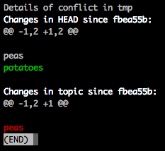

# git-conflict

Simple cmd line tool to help resolve git merge conflicts.

It shows the changes made in the current branch (`HEAD`) vs the changes made in the other branch (`MERGE_HEAD`), since their common ancestor.

**NOTE:** Your repo must be configured for ["diff3" conflict style](http://psung.blogspot.co.uk/2011/02/reducing-merge-headaches-git-meets.html) (see below for how to do this).

Doesn’t yet work for conflicts which result in a “Temporary merge branch”, sorry.

## Example

Say you have a diff3 conflict which looks like this:

    cauliflower
    <<<<<<< HEAD
    peas
    potatoes
    ||||||| merged common ancestors
    peas
    =======
    >>>>>>> topic
    tomatoes

`git-conflict` will give you this output:

which makes it obvious that one branch added `potatoes` and the other removed `peas`, so the resolution should probably be:

    cauliflower
    potatoes
    tomatoes

## Installation

1. Ensure you have "diff3" conflicts enabled:

        $ git config --global merge.conflictstyle diff3

2. Copy the `git-conflict` script to somewhere on your PATH.

3. Make sure it’s executable:

        $ chmod a+x /path/to/git-conflict

## Usage

1. Have yourself a merry little conflict:

        $ git merge conflicting-branch
        Auto-merging path/to/conflicting-file-1
        CONFLICT (content): Merge conflict in path/to/conflicting-file-1
        Auto-merging path/to/conflicting-file-2
        CONFLICT (content): Merge conflict in path/to/conflicting-file-2
        Auto-merging path/to/conflicting-file-3
        CONFLICT (content): Merge conflict in path/to/conflicting-file-3
        ...

2. Call `git conflict` with the path of the first conflict.

        $ git conflict path/to/conflicting-file-1

3. You’ll see a beautiful representation of the **first** conflict in the file only.

    It shows:

    * Changes in HEAD since the common ancestor
    * Changes in MERGE_HEAD since the common ancestor

4. Fix the conflict in `conflicting-file-1` and save it.

5. Repeat until all conflicts in this file are resolved, then continue to `conflicting-file-2`, and so on.

6. Commit, push, celebrate.

## Licence

CC0 / Public domain.
